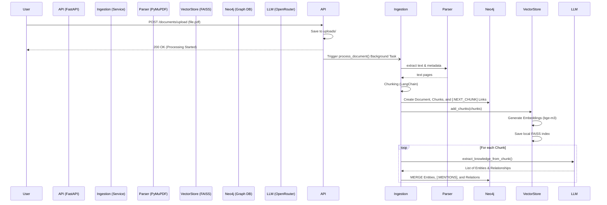
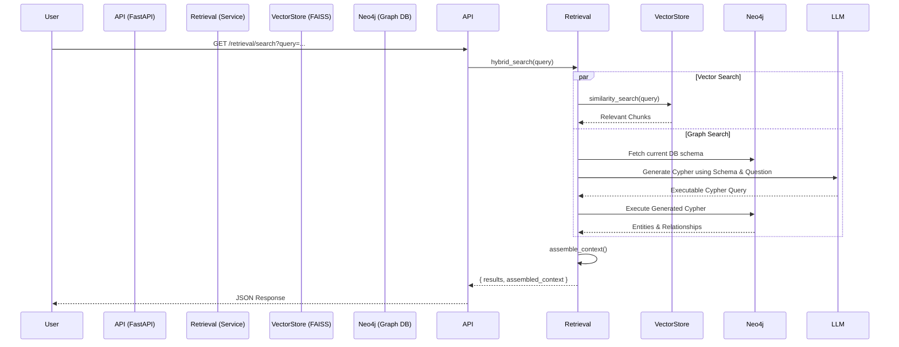

# Codebase Architecture & Flow (KnowledgeGraph-RAG)

This document explains the step-by-step flow of the codebase, detailing how a document travels from being uploaded by a user to being parsed, chunked, embedded, and stored in Neo4j.

## 1. Project Initialization & Configuration

- **`core/config.py`**: This is the heart of our settings. We use Pydantic `BaseSettings` to load environment variables from the `.env` file. It holds critical details like `NEO4J_URI`, `NEO4J_USER`, and `NEO4J_PASSWORD`. Any other module that needs settings imports `settings` from here.
- **`main.py`**: The entry point of the FastAPI application.
  - **Lifespan Event**: When the server starts, it automatically calls the Neo4j client to verify connectivity and runs our Cypher scripts to ensure database constraints exist.
  - **Router Registration**: It registers the API routers (like `/documents/upload`).

## 2. Database Connections

- **`db/neo4j_client.py`**: Creates a singleton `Neo4jClient` class that manages the driver connection to the Neo4j database using the credentials from `core/config.py`. It provides methods to connect, verify, and cleanly close the database connection.
- **`db/cypher_init.py`**: Contains the `init_db_schema()` function. This runs Cypher commands to enforce uniqueness constraints (e.g., `Document ID` must be unique) and creates full-text indexes to optimize searching.

## 3. Data Models

- **`models/schema.py`**: Defines strict data structures using Pydantic. 
  - `DocumentModel`: Metadata about the uploaded file.
  - `ChunkModel`: A piece of text from the document.
  - `EntityModel` & `RelationshipModel`: (To be used in Phase 3) for the Knowledge Graph extraction.

## 4. The Document Ingestion Flow (Phase 2)

When a user hits the API, the following sequence occurs:

### Step 4A: API Request (`api/routes/documents.py`)
1. The user sends a `POST` request to `/documents/upload` with a file (e.g., `paper.pdf`).
2. The FastAPI router accepts the `UploadFile` and saves it physically to the local `uploads/` directory.
3. Instead of making the user wait for parsing to finish, the router hands the file path to a **FastAPI Background Task** and immediately responds with a "Processing started" success message.

### Step 4B: Processing Orchestration (`services/ingestion.py`)
The background task calls `process_document(file_path)`:
1. **Parsing (`utils/parsers.py`)**: The `process_document` function first calls `parse_pdf()`. Using `PyMuPDF` (`fitz`), it opens the PDF and loops through each page, extracting the raw text and logging the page numbers.
2. **Chunking**: The extracted text is then passed to LangChain's `RecursiveCharacterTextSplitter`. It slices the text into overlapping 1,000-character blocks so we don't lose context across page breaks.
3. **Model Creation**: Pydantic `ChunkModel`s and a `DocumentModel` are generated.

### Step 4C: Saving to the Databases
Still inside `process_document()`, the data is saved in two places:
1. **Graph Database (Neo4j)**: `save_to_neo4j()` executes a Cypher `MERGE` query. It creates the `Document` node, creates the `Chunk` nodes, and connects them with a `[:HAS_CHUNK]` relationship.
2. **Vector Database (`services/vector_store.py`)**: `get_vector_store().add_chunks()` is called. It loads the `BAAI/bge-m3` HuggingFace embedding model, converts all chunk text into numerical vectors, and persists those vectors to disk in the `faiss_index/` directory.

## 5. Knowledge Graph Construction (Phase 3)

After the chunks are saved to the databases, the system extracts actual knowledge.

1. **Sequential Linking**: The `ingestion` service adds a `[:NEXT_CHUNK]` relationship between sequential chunks to establish a clear reading order in Neo4j.
2. **LLM Extraction (`services/extraction.py`)**: The text of each chunk is passed to an LLM via OpenRouter (using `langchain-openai`). We instruct the LLM to dynamically discover and infer relevant Entity Types (PascalCase) and Relationship Types (UPPER_SNAKE_CASE) based on the text, supporting diverse domains (medical, legal, etc.). We use structured outputs to return `EntityModel` and `RelationshipModel` objects.
3. **Graph Building (`services/graph_builder.py`)**: The extracted data is sent to Neo4j. We `MERGE` the entities to avoid duplicates, link the original `Chunk` to the `Entity` with `[:MENTIONS]`, and link the Entities to each other using the dynamically extracted relationships.

## Summary Diagram

## 6. The Retrieval Flow (Phase 4)

When a user searches the knowledge base:

1. **API Request**: The user sends a `GET` request to `/retrieval/search?query=...&mode=hybrid`.
2. **Vector Search**: The query is passed to `FAISS` via `HuggingFaceEmbeddings` (BGE-M3) to retrieve the top `k` most semantically similar text chunks.
3. **Graph Search**: 
   - **Schema-Aware Generation**: The query is passed to LangChain's `GraphCypherQAChain`, which dynamically connects to Neo4j to fetch the current graph schema.
   - **Targeted Traversal**: The LLM writes a precise Cypher query based on the user's natural language question and the exact relationships available in the database, seamlessly handling complex multi-hop queries involving multiple entities and relationships.
4. **Context Assembly**: The results from both vector and graph searches are merged into a single structured string. This provides the LLM with both exact quotes (from chunks) and structural facts (from the graph).

