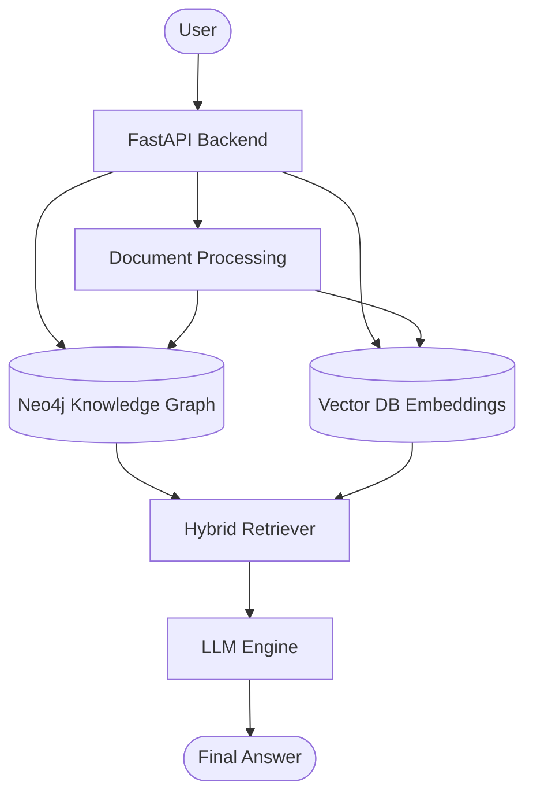

# Product Requirements Document (PRD): KnowledgeGraph-RAG

## 1. Project Overview

| Field | Value |
| :--- | :--- |
| **Project Name** | KnowledgeGraph-RAG |
| **Version** | 1.0 |
| **Owner** | Saket Gupta |
| **Type** | AI Engineering + Graph Database + GraphRAG |
| **Timeline** | 8–10 Weeks |
| **Status** | Planning |

## 2. Vision
Build a production-ready AI system capable of transforming unstructured documents into a rich Knowledge Graph stored inside Neo4j, enabling intelligent graph-based retrieval, hybrid retrieval, and LLM-powered question answering.

Unlike traditional RAG systems that rely only on vector similarity, this system will reason over explicit relationships between entities, concepts, documents, and facts. The objective is not only to answer questions but to understand the knowledge structure inside documents.

## 3. Problem Statement
Modern RAG systems have several limitations:
* Semantic search ignores explicit relationships.
* Vector databases cannot naturally represent interconnected knowledge.
* Long documents lose structural context.
* Cross-document reasoning is difficult.
* Hallucinations increase when context retrieval is incomplete.

Knowledge Graphs solve these issues by representing documents as interconnected entities and relationships.

## 4. Goals

### Primary Goals
* [x] Convert documents into Knowledge Graphs
* [x] Store graphs in Neo4j
* [x] Support Graph-based Retrieval
* [x] Support Hybrid Retrieval
* [x] Support Natural Language Question Answering
* [x] Learn Neo4j from beginner to production

### Secondary Goals
* Learn Graph Data Modeling
* Learn Cypher
* Learn Neo4j Driver
* Learn APOC
* Learn GraphRAG
* Learn Ontology Design
* Learn Entity Resolution
* Learn Knowledge Graph Evaluation

## 5. Target Users
* **AI Engineers**: Need better retrieval than vector search.
* **Researchers**: Need to understand relationships across papers.
* **Students**: Need concept-level understanding.
* **Organizations**: Need enterprise knowledge management.

## 6. Use Cases

### Academic Papers
* **Flow**: Upload `GraphRAG.pdf` ➔ Automatically generate: Paper ➔ Author ➔ Institution ➔ Method ➔ Embedding Model ➔ Dataset ➔ Metric ➔ Result

### Company Documents
* Policies
* SOPs
* Architecture docs
* Meeting Notes

### Medical Research
* Diseases
* Treatments
* Medicines
* Clinical Trials

### Legal Documents
* Contracts
* Clauses
* Entities
* Relationships

### Financial Reports
* Companies
* Investments
* Subsidiaries
* Transactions

## 7. Functional Requirements

### Module 1: Document Upload
* **Supported formats**: PDF, DOCX, TXT, Markdown
* **Features**: Multiple document upload, Metadata extraction, Duplicate detection

### Module 2: Document Processing
* **Pipeline**: Upload ➔ Extract Text ➔ Clean Text ➔ Chunk ➔ Metadata
* **Chunk Metadata**: Each chunk stores Document ID, Chunk ID, Page Number, Section, Source, Timestamp

### Module 3: Entity Extraction
* **LLM extracts**: People, Organizations, Concepts, Models, Algorithms, Libraries, Datasets, Benchmarks, Metrics, Countries, Dates, Technologies, Products, Methods, Tasks, Domains
* **Example**:
  * *Input*: BAAI developed BGE-M3.
  * *Output*: Organization (BAAI), Model (BGE-M3), Relationship (DEVELOPED)

### Module 4: Relationship Extraction
* **Extract**: `USES`, `CREATED_BY`, `MENTIONS`, `WORKS_FOR`, `LOCATED_IN`, `PART_OF`, `IMPROVES`, `COMPARES_WITH`, `EVALUATED_ON`, `TRAINED_ON`, `USES_DATASET`, `CITES`, `SIMILAR_TO`

### Module 5: Entity Resolution
* **Merge**: Resolve similar entities (e.g., `Neo4j`, `Neo 4j`, `neo4j` ➔ `Neo4j`; `Open AI`, `OpenAI`, `Open-AI` ➔ `OpenAI`)

### Module 6: Ontology Validation
* **Validate**: Node Labels, Relationship Types, Property Names, Cardinality, Constraints

### Module 7: Graph Builder
* Automatically create Nodes, Relationships, Properties, Indexes, Constraints
* Store everything inside Neo4j

### Module 8: Graph Visualization
* **Interactive graph features**: Zoom, Expand, Collapse, Highlight paths, Community coloring, Filters

### Module 9: Search
* **Search by**: Entity, Relationship, Property, Cypher, Natural Language

### Module 10: Hybrid Retrieval
* **Pipeline**: Retrieve from Knowledge Graph + Vector Database + Metadata ➔ Combine ➔ Rank ➔ LLM

### Module 11: Graph Question Answering
* **Example Flow**: Which embedding models are evaluated on BEIR? ➔ Cypher ➔ Neo4j ➔ Relevant Subgraph ➔ LLM ➔ Answer

### Module 12: Graph Analytics
* **Run**: PageRank, Communities, Similarity, Centrality, Shortest Path, Connected Components, Node Importance

### Module 13: Evaluation Dashboard
* **Evaluate**: Entity Precision, Relationship Precision, Recall, Faithfulness, Context Precision, Answer Relevance, Graph Density, Average Degree, Hallucination Rate, Latency

## 8. Non-Functional Requirements

### Performance
* <2 sec query latency
* Batch document processing
* Async ingestion

### Scalability
* 1 Million Nodes
* 5 Million Relationships

### Reliability
* Retry mechanisms
* Logging
* Error handling

### Maintainability
* Modular architecture

## 9. Proposed Architecture

## 10. Technology Stack
* **Backend**: Python, FastAPI
* **Graph**: Neo4j, Cypher, APOC, Graph Data Science
* **AI**: LangChain, LangGraph (later phases), PydanticAI (optional exploration)
* **LLM**: OpenAI, Gemini, Ollama (local experimentation)
* **Embeddings**: BAAI/bge-m3, Jina Embeddings, Nomic Embed
* **Vector Database**: FAISS (development), Qdrant (production-ready option)
* **Frontend**: Streamlit ➔ React (future)
* **Monitoring**: LangSmith (optional), MLflow (optional), Prometheus + Grafana (future)

## 11. Database Schema (High-Level)

### Structure
* `Document` ➔ `HAS_CHUNK` ➔ `Chunk` ➔ `MENTIONS` ➔ `Entity` ➔ `INSTANCE_OF` ➔ `EntityType`

### Entity Types
* Paper, Author, Organization, Dataset, Model, Technique, Metric, Task, Framework, Language, Library

### Relationships
* `USES`, `CREATED_BY`, `AUTHORED`, `WORKS_FOR`, `MENTIONS`, `DEPENDS_ON`, `IMPROVES`, `TRAINED_ON`, `EVALUATED_ON`, `SIMILAR_TO`, `CITES`

## 12. API Endpoints (Initial)
* `POST /documents/upload`
* `POST /documents/process`
* `GET /documents`
* `GET /graph/entity/{id}`
* `GET /graph/search`
* `POST /graph/query`
* `POST /chat`
* `GET /analytics`
* `GET /metrics`

## 13. Development Roadmap

### Phase 1 — Neo4j Foundations
* Graph modeling, Cypher basics, Constraints and indexes, Sample dataset
* **Outcome**: Understand graph databases and design a clean schema.

### Phase 2 — Document Ingestion
* File upload, Text extraction, Chunking, Metadata pipeline
* **Outcome**: Documents become structured chunks.

### Phase 3 — Knowledge Graph Construction
* Entity/Relationship extraction, Entity resolution, Ontology validation, Persist graph in Neo4j
* **Outcome**: Documents are converted into a high-quality knowledge graph.

### Phase 4 — Retrieval Engine
* Cypher-based graph retrieval, Vector search, Hybrid retrieval, Context assembly
* **Outcome**: Retrieve relevant evidence using both graph and semantic search.

### Phase 5 — Intelligent Q&A
* Natural language ➔ Cypher, LLM reasoning over retrieved subgraphs, Source attribution and citations
* **Outcome**: Users can ask complex questions and receive grounded answers.

### Phase 6 — Analytics & Evaluation
* Graph algorithms, Quality metrics, Retrieval evaluation, Hallucination tracking, Performance dashboard
* **Outcome**: A measurable, production-style GraphRAG platform.

## 14. Future Enhancements
* Multi-document incremental ingestion
* Streaming updates
* Temporal knowledge graphs
* Multi-hop reasoning agents
* MCP integration
* Multi-agent graph workflows
* Graph embeddings for recommendations
* Fine-grained access control
* Multi-tenant deployment
* Knowledge graph versioning
* Graph diffing and change history
* Automated ontology evolution

## 15. Success Criteria
A successful project will:
1. Convert diverse documents into a clean Neo4j knowledge graph.
2. Support robust entity and relationship extraction with normalization.
3. Answer questions using graph traversal, hybrid retrieval, and LLM reasoning.
4. Demonstrate production-quality architecture, evaluation, and scalability.
5. Serve as a complete learning journey covering Neo4j, knowledge graphs, GraphRAG, and modern AI engineering from fundamentals to deployment.

### Why this is an excellent project
This single project naturally combines nearly everything learned over the past few months:
* **Neo4j & Cypher** through graph modeling and querying.
* **Knowledge Graph engineering** via ontology design and entity resolution.
* **RAG & GraphRAG** through hybrid retrieval.
* **LLM engineering** using structured extraction and grounded generation.
* **Evaluation** with the retrieval quality techniques already explored.
* **Production engineering** using FastAPI, modular architecture, and scalable design.

Rather than building isolated demos, you'll finish with one cohesive system that demonstrates the complete lifecycle of a modern GraphRAG application.
